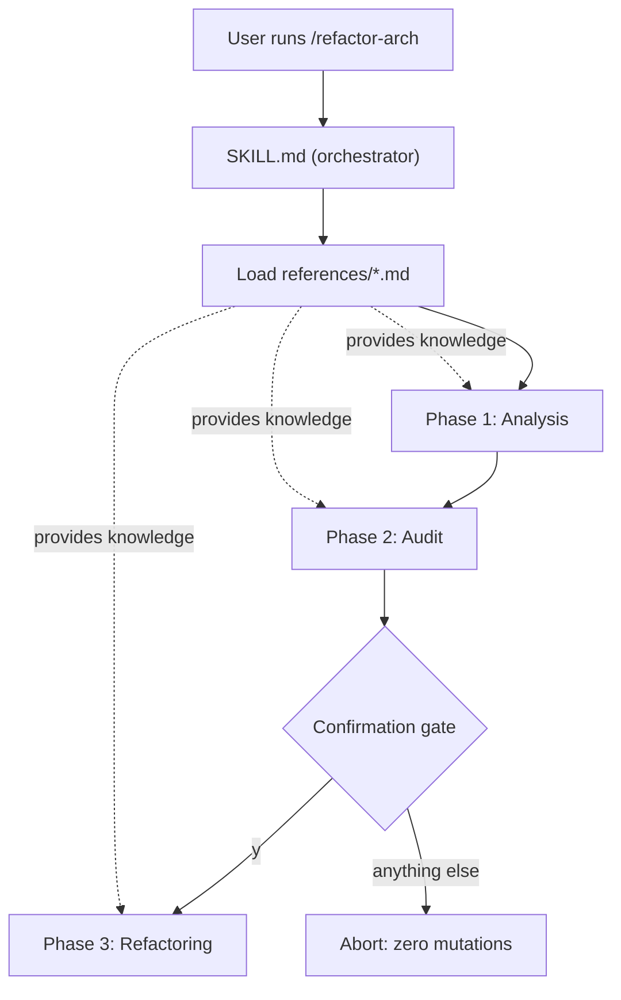

# Technical Specification: Skill Orchestration & Invocation (F01)

## Section 1: Technical Overview

**What:** Build the foundation of the `refactor-arch` Claude Code Skill: the `.claude/skills/refactor-arch/` folder, the `SKILL.md` entry point that is triggered by `/refactor-arch`, the strict three-phase orchestration (Analysis → Audit → Refactoring), the mandatory human confirmation gate between Phase 2 and Phase 3, and the five Markdown reference-knowledge files that every later phase loads. F01 authors the **full content** of the five reference files; F02–F04 later add only their per-phase execution instructions into the SKILL.md phase sections.

**Why:** Every downstream phase (F02, F03, F04) depends on a stable skill skeleton and on the shared domain knowledge being present and loadable. Centralizing the knowledge in versioned Markdown — rather than in stack-specific scripts — is what makes the skill technology-agnostic and copyable unchanged into any project. The confirmation gate must live in the orchestration layer so that no phase can ever mutate files before a human approves.

**Scope:**

**Included:**
- Skill folder scaffold: `.claude/skills/refactor-arch/` with a `references/` subfolder
- `SKILL.md` with frontmatter, invocation trigger, three-phase sequencing, reference-loading instructions, the confirmation gate, and orchestration-level error handling
- Full authored content of five reference files: detection heuristics, anti-pattern catalog (≥8 anti-patterns across all four severities including deprecated-API detection), audit report template, MVC architecture guidelines, and refactoring playbook (≥8 before/after transformation patterns)
- Provides contract: loadable reference knowledge (consumed by F02, F03, F04) and the confirmation gate decision (consumed by F04)

**Excluded (owned by other features):**
- Per-phase execution logic for detection, audit reasoning, and refactoring transformations (F02, F03, F04 add these into the SKILL.md phase sections)
- Creation of the runtime `reports/` output directory (F03 handles at audit time)
- Any modification of the three target projects' source

## Section 2: Architecture Impact

**Affected components (all new):**

| Path | Role |
|------|------|
| `.claude/skills/refactor-arch/SKILL.md` | Orchestrator + gate |
| `.claude/skills/refactor-arch/references/detection-heuristics.md` | Knowledge for F02 |
| `.claude/skills/refactor-arch/references/anti-patterns-catalog.md` | Knowledge for F03 |
| `.claude/skills/refactor-arch/references/report-template.md` | Knowledge for F03 |
| `.claude/skills/refactor-arch/references/mvc-guidelines.md` | Knowledge for F04 |
| `.claude/skills/refactor-arch/references/refactoring-playbook.md` | Knowledge for F04 |

## Section 3: Technical Decisions

| Decision | Chosen Approach | Alternative Considered | Trade-off |
|----------|-----------------|------------------------|-----------|
| Reference-knowledge ownership | F01 authors full content of all five reference files | Scaffold empty files; F02–F04 populate content | Front-loads F01 effort, but keeps knowledge cohesive in one place and satisfies the ≥8-catalog / ≥8-playbook acceptance criteria within F01 |
| Confirmation gate implementation | Instruction-based pause in SKILL.md — agent presents report, stops, awaits `y/n` in conversation | Helper script reading stdin `[y/n]` with exit code | Keeps the skill pure Markdown and tech-agnostic; relies on the agent honoring the stop instruction rather than a programmatic guard |
| Knowledge format | Pure Markdown reference files, no executable scripts | Python/JS helper scripts for detection/validation | Copyable and stack-agnostic; loses programmatic enforcement, so structure is enforced by convention and lint checks |
| Reference file layout | Files under a `references/` subfolder | Flat files beside `SKILL.md` | Matches conventional Claude Code skill layout and keeps the entry point uncluttered |
| Phase sequencing authority | Sequencing + gate defined once in the orchestrator; phases are ordered sections in SKILL.md | Each phase as a separate skill invoked independently | Guarantees strict order and a single gate; phases cannot be run out of sequence or skip the gate |

## Section 4: Component Overview

**Skill files:**

| File Path | New/Modified | Purpose | Key Responsibilities |
|-----------|--------------|---------|----------------------|
| `.claude/skills/refactor-arch/SKILL.md` | New | Entry point and orchestrator | Frontmatter + `/refactor-arch` trigger; enforce Analysis→Audit→Refactoring order; instruct loading of all reference files; define the confirmation gate; orchestration-level error handling |
| `.claude/skills/refactor-arch/references/detection-heuristics.md` | New | Stack-detection knowledge | Signal-based rules to identify language, framework/version, dependencies, DB, domain, architecture (consumed by F02) |
| `.claude/skills/refactor-arch/references/anti-patterns-catalog.md` | New | Anti-pattern knowledge | ≥8 anti-patterns with detection signals and severity across CRITICAL/HIGH/MEDIUM/LOW, including deprecated-API detection (consumed by F03) |
| `.claude/skills/refactor-arch/references/report-template.md` | New | Audit report format | Standardized report layout: header, per-severity summary, ordered findings block (consumed by F03) |
| `.claude/skills/refactor-arch/references/mvc-guidelines.md` | New | Target architecture rules | MVC layer definitions (config, models, views/routes, controllers, error handling, entry point) (consumed by F04) |
| `.claude/skills/refactor-arch/references/refactoring-playbook.md` | New | Transformation patterns | ≥8 before/after transformation patterns mapping anti-patterns to fixes (consumed by F04) |

## Section 5: Internal Interface Contracts

This feature exposes no HTTP API. Its "Provides" contracts are internal knowledge and control signals consumed by later phases (per PRD Section 6 Provides / Section 9 Cross-Feature Integration). They are defined here as the loadable-reference contract and the gate contract.

**Contract A: Loaded Reference Knowledge** — consumed by F02, F03, F04

| Reference file | Consumed by | Guaranteed to contain |
|----------------|-------------|------------------------|
| `references/detection-heuristics.md` | F02 | Language, framework/version, dependency, DB, domain, and architecture detection signals |
| `references/anti-patterns-catalog.md` | F03 | ≥8 anti-patterns, each with name, severity, detection signal; all four severities present; deprecated-API detection included |
| `references/report-template.md` | F03 | Report skeleton with header fields, per-severity summary line, and per-finding block layout |
| `references/mvc-guidelines.md` | F04 | Definitions for config, models, views/routes, controllers, centralized error handling, entry point |
| `references/refactoring-playbook.md` | F04 | ≥8 transformation patterns, each with a before and an after example |

Contract guarantee: all five files exist at the paths above and are loadable at invocation. If any file is missing, the orchestrator reports which file is missing and refuses to run any phase.

**Contract B: Confirmation Gate Decision** — consumed by F04

| Signal | Values | Semantics |
|--------|--------|-----------|
| gate decision | `proceed` (input was exactly `y`) or `abort` (any other input) | `proceed` → Phase 3 (F04) executes; `abort` → skill exits with zero file mutations |

Gate guarantee: the decision is captured only after the Phase 2 report is fully presented, and no source file is written before the decision is `proceed`.

## Section 6: Reference Knowledge Schema

Since the feature persists knowledge in Markdown rather than a database, this section defines the required structure ("schema") of each reference file instead of table columns.

**`anti-patterns-catalog.md` — catalog entry structure**

| Field | Required | Description |
|-------|----------|-------------|
| Name | Yes | Anti-pattern name (e.g., "God Class", "Hardcoded Credentials", "N+1 Query", "Deprecated API Usage") |
| Severity | Yes | One of CRITICAL, HIGH, MEDIUM, LOW |
| Detection signal | Yes | Concrete, actionable signal (e.g., "SQL query string built with f-string inside a route handler") |
| Impact | Yes | Why it matters |
| Recommendation | Yes | How to fix, referencing a playbook pattern |

Constraints: ≥8 entries; at least one entry per severity; at least one entry is deprecated-API detection.

**`refactoring-playbook.md` — pattern entry structure**

| Field | Required | Description |
|-------|----------|-------------|
| Target anti-pattern | Yes | The catalog anti-pattern this pattern resolves |
| Before | Yes | Code/structure example showing the smell |
| After | Yes | Code/structure example showing the MVC-conformant fix |
| Notes | No | Caveats or stack-specific guidance |

Constraints: ≥8 entries; every catalog anti-pattern that is fixable maps to at least one playbook pattern.

**`report-template.md` — required blocks**

| Block | Required | Description |
|-------|----------|-------------|
| Header | Yes | Project name, stack, files/line counts |
| Severity summary | Yes | `CRITICAL: n | HIGH: n | MEDIUM: n | LOW: n` and total |
| Finding block | Yes | `[SEVERITY] Name`, File `path:line`, Description, Impact, Recommendation |

**`detection-heuristics.md` — required categories**

| Category | Required | Example signal |
|----------|----------|----------------|
| Language | Yes | `.py` files + `requirements.txt` → Python |
| Framework/version | Yes | `from flask import` / `require('express')` |
| Dependencies | Yes | Parse `requirements.txt` / `package.json` |
| Database/tables | Yes | Scan SQL/ORM/schema definitions |
| Domain | Yes | Infer from routes/models/table names |
| Architecture | Yes | Count files and layer separation |

**`mvc-guidelines.md` — required layers**

| Layer | Required | Definition |
|-------|----------|------------|
| Config | Yes | Externalized configuration/secrets, no hardcoded values |
| Models | Yes | Data abstraction per domain |
| Views/Routes | Yes | Routing only |
| Controllers | Yes | Application flow / orchestration |
| Error handling | Yes | Centralized handler/middleware |
| Entry point | Yes | Clear composition root |

## Section 7: Testing Strategy

Because the deliverable is a prompt-driven Markdown skill, verification combines automatable structural lint checks with behavioral runs against the three target projects. No unit-test framework is introduced.

**Structural checks (automatable):**

| Check | Target | Assertion |
|-------|--------|-----------|
| Folder scaffold | `.claude/skills/refactor-arch/` | Folder and `references/` subfolder exist |
| Files present | The six skill files | `SKILL.md` + five reference files all exist |
| Catalog minimum | `anti-patterns-catalog.md` | ≥8 anti-pattern entries; all four severities present; ≥1 deprecated-API entry |
| Playbook minimum | `refactoring-playbook.md` | ≥8 pattern entries, each with a before and an after block |
| Frontmatter | `SKILL.md` | Valid frontmatter with the `/refactor-arch` trigger and description |
| No executables | Skill folder | Only Markdown files; no scripts |

**Acceptance tests (behavioral, derived from PRD Section 9 F01 criteria):**

| Test | Description | Assertions |
|------|-------------|------------|
| `test_invocation_no_flags` | Run `claude "/refactor-arch"` from a target project root | Pipeline starts with no additional flags |
| `test_phase_order` | Observe full run | Phases run Analysis → Audit → Refactoring; Phase 3 never starts before Phase 2 finishes |
| `test_references_loaded` | Inspect a run | All five reference files are loaded and used by the phases |
| `test_gate_decline_no_mutation` | Answer anything other than `y` at the gate | Skill exits; zero files modified |
| `test_gate_accept_proceeds` | Answer `y` at the gate | Phase 3 executes |
| `test_copyable_unchanged` | Copy the skill folder unchanged into a second target project and run | Full pipeline runs correctly |
| `test_missing_reference` | Remove one reference file and run | Orchestrator names the missing file and refuses to continue |
| `test_no_source_files` | Run in a directory with no analyzable source | Reports `No analyzable source files found` and stops before Phase 2 |

**Integration tests (from PRD Section 9 Cross-Feature Integration referencing F01):**

| Test | Description | Assertions |
|------|-------------|------------|
| `test_knowledge_feeds_phases` | Run the full pipeline on each target project | The heuristics, catalog, MVC guidelines, and playbook loaded by F01 are the exact knowledge F02/F03/F04 use; no phase relies on hardcoded stack assumptions |
| `test_gate_controls_f04` | Toggle the gate decision | `proceed` runs F04; `abort` leaves the project unmodified |
