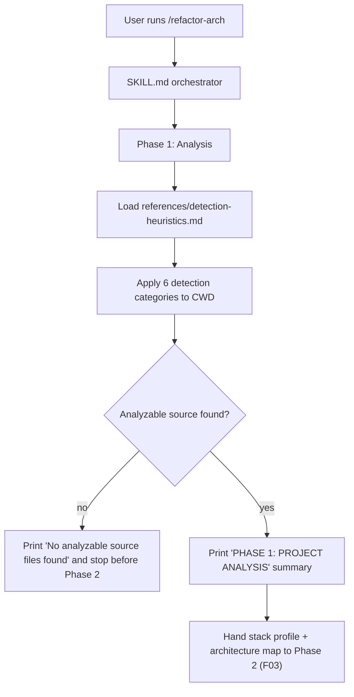

# Technical Specification: Phase 1 — Project Analysis (F02)

## Section 1: Technical Overview

**What:** Author the execution logic for **Phase 1 (Analysis)** of the
`refactor-arch` skill by filling the Phase 1 section of the existing
`.claude/skills/refactor-arch/SKILL.md`. Phase 1 loads the detection knowledge
authored in F01 (`references/detection-heuristics.md`) and applies it to the
project rooted at the current working directory: it detects the language, the
framework (with version when available), the dependency list, the database
tables/entities, the application domain, and the current architecture, then
prints a fixed-format `PHASE 1: PROJECT ANALYSIS` summary block. Phase 1 is
strictly read-only — it modifies no source file — and it produces the **stack
profile** and **architecture map** that Phase 2 (F03) reasons over.

**Why:** F03's audit is only as good as the stack facts it reasons over. By
concentrating all detection into one prompt-driven phase that reads exclusively
from the F01 heuristics reference, the audit stays technology-agnostic and the
same skill folder keeps working unchanged across Python/Flask and
Node.js/Express projects. Phase 1 must also be the guard that stops the pipeline
early when there is nothing analyzable, so no downstream phase runs against an
empty or unrecognized directory.

**Scope:**

**Included:**
- Phase 1 execution instructions written into the `SKILL.md` Phase 1 section:
  loading `references/detection-heuristics.md`; applying its six detection
  categories; printing the `PHASE 1: PROJECT ANALYSIS` summary block.
- Detection of: language; framework + version; dependencies; database
  tables/entities; application domain; current architecture; and an accurate
  analyzed-source-file count.
- The read-only guarantee (no file writes during Phase 1).
- Early-stop behavior when no analyzable source files are found.
- The **stack profile** + **architecture map** hand-off contract consumed by
  F03 (defined in Section 5).

**Excluded (owned by other features):**
- The detection *knowledge* itself — the six-category heuristics content is
  authored by F01 in `references/detection-heuristics.md`; F02 only consumes it.
- Anti-pattern cross-referencing, findings, severity, and the audit report
  (F03).
- The confirmation gate and Phase 3 refactoring (F01 orchestration / F04).
- Any modification of the target projects' source (Phase 1 is read-only by
  contract).

## Section 2: Architecture Impact

**Affected components:**

| Path | Role | New/Modified |
|------|------|--------------|
| `.claude/skills/refactor-arch/SKILL.md` (Phase 1 section) | Phase 1 execution logic | Modified |
| `.claude/skills/refactor-arch/references/detection-heuristics.md` | Detection knowledge (read-only input) | Consumed (from F01) |

## Section 3: Technical Decisions

| Decision | Chosen Approach | Alternative Considered | Trade-off |
|----------|-----------------|------------------------|-----------|
| Where Phase 1 logic lives | Instructions authored into the `SKILL.md` Phase 1 section | A separate `phase-1.md` file loaded by the orchestrator | Keeps the phase sequence and its logic in one orchestrator file (matches the F01 layout: "F02–F04 add per-phase execution instructions into the SKILL.md phase sections") at the cost of a longer SKILL.md |
| Hand-off to F03 | In-context stack profile + architecture map printed in the summary and carried in the agent's conversation context | Persist an intermediate `analysis.json` for F03 to read | Honors the PRD's "no file modified during Phase 1" guarantee and keeps the skill pure-Markdown; relies on the agent carrying phase output forward in context |
| Analyzed-file count scope | Count source files of the detected language under the project root, excluding dependency/vendor dirs (`node_modules`, `venv`, `.git`), lockfiles, and docs | Count every file in the tree | Makes the reported count match the "real number of source files" a reviewer would expect, at the cost of a defined exclusion list |
| Empty-directory guard | Phase 1 owns the `No analyzable source files found` stop, before Phase 2 | Let the orchestrator pre-check | Puts the check where detection already runs, avoiding a duplicate scan |

## Section 4: Component Overview

| File Path | New/Modified | Purpose | Key Responsibilities |
|-----------|--------------|---------|----------------------|
| `.claude/skills/refactor-arch/SKILL.md` (Phase 1 — Analysis section) | Modified | Phase 1 execution logic | Instruct loading of `references/detection-heuristics.md`; apply the six detection categories to the CWD; assemble and print the `PHASE 1: PROJECT ANALYSIS` summary; enforce the read-only guarantee; stop with `No analyzable source files found` when nothing is analyzable; carry the stack profile + architecture map forward to Phase 2 |
| `.claude/skills/refactor-arch/references/detection-heuristics.md` | Unmodified (consumed) | Detection knowledge input | Provides the Language, Framework/version, Dependencies, Database/tables, Domain, and Architecture signals Phase 1 applies |

## Section 5: Internal Interface Contracts

Phase 1 exposes no HTTP API. Its output is an internal knowledge hand-off
consumed by F03, per PRD Section 6 (F02 Provides) and Section 9 (Cross-Feature
Integration).

**Contract A: Consumes — Detection Heuristics (from F01)**

| Input | Provided by | Guarantee relied upon |
|-------|-------------|-----------------------|
| `references/detection-heuristics.md` | F01 | Contains Language, Framework/version, Dependencies, Database/tables, Domain, and Architecture detection signals; loadable at invocation |

Phase 1 must use these heuristics as its only detection knowledge — no
hardcoded stack assumptions baked into the phase logic.

**Contract B: Provides — Stack Profile + Architecture Map (to F03)**

| Field | Part of | Guaranteed to contain |
|-------|---------|-----------------------|
| Language | Stack profile | The detected language (e.g., Python, Node.js) |
| Framework + version | Stack profile | Framework and its version, or `version unknown` |
| Dependencies | Stack profile | The declared direct dependencies from the manifest |
| Domain | Stack profile | A short domain phrase plus key entities |
| Architecture | Architecture map | High-level structure description (e.g., monolithic vs layered) |
| Source files analyzed | Architecture map | Accurate count matching the real number of source files, and the file list scanned |
| Database tables/entities | Architecture map | Each detected table/entity by name, or `No database layer detected` |

Contract guarantee: every field above is present in the printed summary and
carried in context so F03 can reason over it without re-detecting. No source
file is written while producing this contract.

## Section 6: Analysis Output Schema

Since Phase 1 emits a printed summary rather than a persisted artifact, this
section defines the required structure of that summary block.

**`PHASE 1: PROJECT ANALYSIS` — required fields**

| Field | Required | Description | Example |
|-------|----------|-------------|---------|
| Language | Yes | Detected language | `Python` |
| Framework | Yes | Framework + version (or `version unknown`) | `Flask 3.1.1` |
| Dependencies | Yes | Declared direct dependencies | `flask, flask-cors` |
| Domain | Yes | Domain phrase + key entities | `E-commerce API — produtos, usuários, pedidos` |
| Architecture | Yes | High-level structure | `Monolithic — everything in 4 files, no layer separation` |
| Source files | Yes | Count + list of analyzed source files | `4 (app.py, controllers.py, models.py, database.py)` |
| DB tables | Yes | Detected tables/entities, or `No database layer detected` | `produtos, usuarios, pedidos` |

**Constraints:**
- The block is titled exactly `PHASE 1: PROJECT ANALYSIS`.
- All seven fields appear; a field with no data states the negative explicitly
  (e.g., `No database layer detected`) rather than being omitted.
- The `Source files` count equals the real number of detected-language source
  files under the project root, excluding vendor/dependency dirs, lockfiles,
  and docs.
- No file is modified while the block is produced.

**Reference outcomes for the three validation targets** (illustrative, to
verify accuracy):

| Project | Language | Framework | Architecture | Key tables |
|---------|----------|-----------|--------------|------------|
| `code-smells-project` | Python | Flask 3.1.1 | Monolithic — 4 files, no layers | produtos, usuarios, pedidos |
| `task-manager-api` | Python | Flask 3.0.0 (+ SQLAlchemy) | Partial layering — routes/models/services present | users, tasks, categories |
| `ecommerce-api-legacy` | Node.js | Express 4.18.2 | Monolithic — logic in `src/` (AppManager) | detected from SQL/ORM |

## Section 7: Testing Strategy

Because the deliverable is prompt-driven Markdown, verification combines
automatable structural lint checks with behavioral runs against the three
target projects. No unit-test framework is introduced.

**Structural checks (automatable):**

| Check | Target | Assertion |
|-------|--------|-----------|
| Phase 1 section authored | `SKILL.md` Phase 1 section | Contains detection instructions (not just the F01 stub) and references `detection-heuristics.md` |
| Summary fields present | `SKILL.md` Phase 1 section | Instructs printing all seven `PHASE 1: PROJECT ANALYSIS` fields |
| Read-only guarantee stated | `SKILL.md` Phase 1 section | Explicitly states no file is modified during Phase 1 |
| Empty-source guard | `SKILL.md` Phase 1 section | Instructs printing `No analyzable source files found` and stopping before Phase 2 |
| No hardcoded stack | `SKILL.md` Phase 1 section | Detection reads from `detection-heuristics.md`; no per-project name/stack baked in |

**Acceptance tests (behavioral, from PRD Section 9 F02 criteria):**

| Test | Description | Assertions |
|------|-------------|------------|
| `test_language_detected` | Run Phase 1 on each target project | Language detected correctly (Python ×2, Node.js ×1) |
| `test_framework_version_detected` | Run Phase 1 on each target | Framework + version correct (Flask 3.1.1 / Flask 3.0.0 / Express 4.18.2) |
| `test_db_tables_listed` | Inspect the summary | Database tables/entities present in the project are listed |
| `test_domain_described` | Inspect the summary | Application domain described accurately for each project |
| `test_file_count_matches` | Compare reported count to reality | Reported analyzed-source-file count matches the real number |
| `test_phase1_read_only` | Run Phase 1 and diff the tree | No source file modified during Phase 1 |
| `test_no_analyzable_source` | Run in a directory with no source | Prints `No analyzable source files found` and stops before Phase 2 |

**Integration tests (from PRD Section 9 Cross-Feature Integration referencing F02):**

| Test | Description | Assertions |
|------|-------------|------------|
| `test_heuristics_are_sole_knowledge` | Run Phase 1 across the targets | The heuristics loaded by F01 are the exact knowledge F02 uses; no phase relies on hardcoded stack assumptions |
| `test_profile_feeds_f03` | Run Phase 1 then Phase 2 | The stack profile + architecture map produced by F02 (language, framework, dependencies, domain, analyzed files, DB tables) are the inputs the F03 audit reasons over |

## Section 8: Assumptions & Decisions

Applied where the PRD left a detail open; recorded here for review.

- **Hand-off is in-context, not persisted.** Because the PRD guarantees "no
  file modified during Phase 1," the stack profile + architecture map are
  carried in the agent's conversation context and re-used by F03, not written to
  disk. (Derived from PRD F02 Experience + Error Handling.)
- **Analyzed-file count scope.** Counts source files of the detected language
  under the project root, excluding `node_modules`/`venv`/`.git`, lockfiles, and
  documentation. (Industry-standard default; PRD says the count must "match the
  real number of files.")
- **Dependencies reported = declared direct dependencies** from the manifest
  (`requirements.txt` / `package.json`), not the full transitive tree.
  (Best-practice default; keeps the summary readable.)
- **Version ranges are reported verbatim** (e.g., `^4.18.2`) per the F01
  heuristics rule, rather than resolved to an installed version.
- **Phase 1 logic is authored into `SKILL.md`**, not a separate file, matching
  the F01 spec's stated layout for F02–F04.
