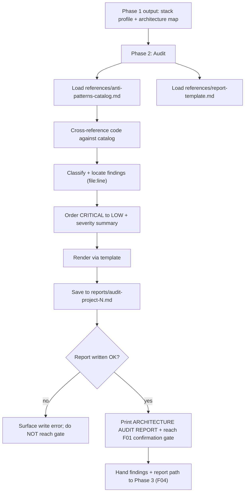

# Technical Specification: Phase 2 — Architecture Audit & Report (F03)

## Section 1: Technical Overview

**What:** Author the execution logic for **Phase 2 (Audit)** of the
`refactor-arch` skill by filling the Phase 2 section of the existing
`.claude/skills/refactor-arch/SKILL.md`. Phase 2 consumes the **stack profile +
architecture map** produced by Phase 1 (F02), cross-references the analyzed code
against `references/anti-patterns-catalog.md`, and produces an ordered list of
**findings** — each classified into exactly one of four severities (CRITICAL,
HIGH, MEDIUM, LOW) and carrying an exact `file:line` location, a description, an
impact statement, and a concrete recommendation. It renders those findings with
`references/report-template.md` (CRITICAL → LOW, with a per-severity summary and
total), **saves** the report to `reports/audit-project-N.md`, and reaches the
mandatory F01 confirmation gate. Phase 2 modifies no *source* file; its only
write is the report artifact under `reports/`.

**Why:** F04's refactor acts on exactly the set of findings F03 produces, so the
audit must be reproducible, severity-ranked, and precisely located
(`file:line`). Concentrating all anti-pattern reasoning into one prompt-driven
phase that reads exclusively from the F01 catalog and template keeps the skill
technology-agnostic and copyable unchanged across Python/Flask and
Node.js/Express projects. Persisting the report gives the reviewer a shareable
record to approve before any code changes, honoring the human-in-the-loop
contract.

**Scope:**

**Included:**
- Phase 2 execution instructions written into the `SKILL.md` Phase 2 section:
  consuming the F02 stack profile + architecture map; cross-referencing the code
  against `references/anti-patterns-catalog.md`; classifying findings by
  severity; ordering CRITICAL → LOW.
- Every finding carrying an exact `file:line` (or `file:start-end`), a
  description, an impact, and a recommendation that names a playbook pattern.
- A per-severity summary count (`CRITICAL: n | HIGH: n | MEDIUM: n | LOW: n`) and
  a total finding count.
- Rendering the report via `references/report-template.md` and **saving** it to
  `reports/audit-project-N.md` (N chosen by sequential gap-filling), creating the
  `reports/` directory if absent.
- Deprecated-API detection (catalog entry AP-11) when applicable to the detected
  stack.
- Error handling: `<5` findings still renders but flags the unmet threshold;
  a report write failure surfaces the error and does **not** advance to the gate.
- Reaching the F01 confirmation gate only **after** the report is fully rendered
  and saved, with no source file modified.
- The **audit findings** + **persisted report** hand-off contract consumed by
  F04 (defined in Section 5).

**Excluded (owned by other features):**
- The anti-pattern *knowledge* and the report *layout* — authored by F01 in
  `references/anti-patterns-catalog.md` and `references/report-template.md`; F03
  only consumes them.
- Stack/architecture detection — produced by F02; F03 consumes it without
  re-detecting.
- The confirmation-gate *mechanics* (prompt, `y`/anything-else capture,
  proceed/abort decision) — owned by the F01 orchestrator; F03 only hands control
  to it after the report is saved.
- Phase 3 refactoring, validation, and any mutation of the target projects'
  source (F04).

## Section 2: Architecture Impact

**Affected components:**

| Path | Role | New/Modified |
|------|------|--------------|
| `.claude/skills/refactor-arch/SKILL.md` (Phase 2 section) | Phase 2 execution logic | Modified |
| `.claude/skills/refactor-arch/references/anti-patterns-catalog.md` | Anti-pattern knowledge (read-only input) | Consumed (from F01) |
| `.claude/skills/refactor-arch/references/report-template.md` | Report layout (read-only input) | Consumed (from F01) |
| `reports/audit-project-N.md` | Persisted audit report (runtime output) | Created at audit time |

## Section 3: Technical Decisions

| Decision | Chosen Approach | Alternative Considered | Trade-off |
|----------|-----------------|------------------------|-----------|
| Where Phase 2 logic lives | Instructions authored into the `SKILL.md` Phase 2 section | A separate `phase-2.md` loaded by the orchestrator | Keeps the phase sequence and its logic in one orchestrator file (matches the F01/F02 layout) at the cost of a longer `SKILL.md` |
| Finding source of truth | Findings come **only** from cross-referencing `anti-patterns-catalog.md`; no ad-hoc or hardcoded checks | Allow free-form findings beyond the catalog | Satisfies the PRD's "no hardcoded stack assumptions" integration criterion and keeps F04's fix mapping deterministic; bounded by catalog coverage (12 entries) |
| Report file numbering (`N`) | Sequential gap-filling: scan `reports/`, pick the lowest unused `audit-project-N.md` | Slug from directory name; or always `N=1` overwriting | Preserves prior reports across runs and matches the numeric `N` in the PRD/template, at the cost of a directory scan before writing |
| Confirmation gate ownership | F03 renders + saves + presents the report, then **reaches** the gate; the prompt and decision capture stay in the F01 orchestrator | Re-implement the gate prompt inside Phase 2 | Single gate authority (no phase can bypass it), no duplicated prompt logic; F03 must guarantee the report is saved before yielding to the gate |
| Report write is the only allowed write | Phase 2 writes exactly one file under `reports/`; no source file is touched | Persist findings as JSON too | Honors "no source file modified before Phase 3" while still giving F04 a durable artifact; findings are also carried in-context |
| Line/finding counts | Derive `Files analyzed` / `Lines analyzed` from the F02 architecture map and the scanned files; total findings from the classified set | Recompute file inventory independently | Reuses F02's analyzed-file list (no re-detection) and keeps the header consistent with Phase 1's report |

## Section 4: Component Overview

| File Path | New/Modified | Purpose | Key Responsibilities |
|-----------|--------------|---------|----------------------|
| `.claude/skills/refactor-arch/SKILL.md` (Phase 2 — Audit section) | Modified | Phase 2 execution logic | Consume the F02 stack profile + architecture map; load and cross-reference `anti-patterns-catalog.md`; classify each finding into CRITICAL/HIGH/MEDIUM/LOW with an exact `file:line`, description, impact, and recommendation; order CRITICAL → LOW; compute the per-severity summary + total; render via `report-template.md`; save to `reports/audit-project-N.md` (gap-filling N, creating `reports/` if absent); handle `<5`-finding and write-failure cases; reach the F01 gate only after the report is saved |
| `.claude/skills/refactor-arch/references/anti-patterns-catalog.md` | Unmodified (consumed) | Anti-pattern knowledge input | Provides the 12 catalog entries (names, severities, detection signals, impacts, recommendations) F03 cross-references, including deprecated-API detection (AP-11) |
| `.claude/skills/refactor-arch/references/report-template.md` | Unmodified (consumed) | Report layout input | Provides the required Header, Severity Summary, and Finding-block structure and ordering rules F03 renders |
| `reports/audit-project-N.md` | New (runtime) | Persisted audit report | The rendered report for the audited project, saved for the reviewer and consumed by F04 |

## Section 5: Internal Interface Contracts

Phase 2 exposes no HTTP API. It consumes an in-context hand-off from F02 and
provides an in-context findings set plus a persisted report file to F04, per PRD
Section 6 (F03 Consumes / Provides) and Section 9 (Cross-Feature Integration).

**Contract A: Consumes — Stack Profile + Architecture Map (from F02)**

| Input | Provided by | Guarantee relied upon |
|-------|-------------|-----------------------|
| Language, Framework + version, Dependencies, Domain | F02 stack profile | Present in context from Phase 1; no re-detection needed |
| Architecture description, analyzed source-file list + count, DB tables | F02 architecture map | Accurate file list to locate `file:line`; count feeds the report header |

**Contract B: Consumes — Anti-Pattern Catalog + Report Template (from F01)**

| Input | Provided by | Guarantee relied upon |
|-------|-------------|-----------------------|
| `references/anti-patterns-catalog.md` | F01 | ≥8 anti-patterns across all four severities incl. deprecated-API; each has name, severity, detection signal, impact, recommendation |
| `references/report-template.md` | F01 | Header + severity-summary + finding-block layout with CRITICAL → LOW ordering rules |

**Contract C: Provides — Audit Findings + Persisted Report (to F04)**

| Field | Part of | Guaranteed to contain |
|-------|---------|-----------------------|
| Anti-pattern name | Each finding | The catalog entry the code matched (e.g., `Hardcoded Credentials`) |
| Severity | Each finding | Exactly one of CRITICAL / HIGH / MEDIUM / LOW |
| Location | Each finding | An exact `file:line` or `file:start-end` |
| Description / Impact / Recommendation | Each finding | What is wrong, why it matters, and the fix naming a playbook pattern (e.g., P-01) |
| Severity summary + total | Findings set | `CRITICAL: n | HIGH: n | MEDIUM: n | LOW: n` and a total count |
| Report path | Persisted artifact | `reports/audit-project-N.md`, fully rendered and saved before the gate |

Contract guarantee: the findings set is ordered CRITICAL → LOW, carried in
context, **and** persisted to `reports/audit-project-N.md`; the persisted report
reflects the same findings F04 acts upon. No source file is written while
producing this contract. Control is handed to the F01 confirmation gate only
after the report file exists on disk.

## Section 6: Audit Report Output Schema

Phase 2 emits a rendered report (printed and persisted). This section defines the
required structure of that report, per `references/report-template.md`.

**`ARCHITECTURE AUDIT REPORT` — required blocks**

| Block | Required | Content |
|-------|----------|---------|
| Header | Yes | `Project`, `Stack` (language / framework version), `Domain`, `Files analyzed` (count), `Lines analyzed` (count), `Date` |
| Severity Summary | Yes | Exact form `CRITICAL: n | HIGH: n | MEDIUM: n | LOW: n` followed by `Total findings: <total>` |
| Threshold flag | Conditional | If total `< 5`, include the warning line that the minimum finding threshold was not met |
| Finding block (×N) | Yes | Per finding, in order: `[SEVERITY] <Anti-pattern name>`, **File** `path:line`, **Description**, **Impact**, **Recommendation** (naming a playbook pattern) |

**Constraints:**
- Findings are ordered strictly CRITICAL → HIGH → MEDIUM → LOW; within a
  severity, most-impactful first.
- Every finding carries an exact `file:line` or `file:start-end`.
- Every finding has all four of: severity, description, impact, recommendation.
- The report is titled `ARCHITECTURE AUDIT REPORT` and saved to
  `reports/audit-project-N.md`; the confirmation gate is reached only after this
  file is written.
- At least 5 findings are expected per project, with at least 1 CRITICAL or HIGH;
  if fewer than 5 are found, the report still renders and flags the shortfall.
- No source file is modified while the report is produced.

**Reference outcomes for the three validation targets** (illustrative, to verify
the audit surfaces real issues):

| Project | Expected representative findings | Meets ≥5 / ≥1 CRITICAL-HIGH |
|---------|----------------------------------|------------------------------|
| `code-smells-project` | Monolithic God File (AP-04), business logic in handlers (AP-05), N+1 (AP-07), magic numbers (AP-10), missing error handling (AP-09) | Yes |
| `task-manager-api` | Business logic in routes (AP-05), duplicated logic (AP-08), tight coupling / no DI (AP-06), deprecated API (AP-11), magic numbers (AP-10) | Yes |
| `ecommerce-api-legacy` | Hardcoded credentials/seed passwords (AP-01), missing auth on `/api/admin` & delete (AP-03), God Class `AppManager` (AP-04), N+1 in financial report (AP-07), plaintext password handling | Yes (CRITICAL present) |

## Section 7: Testing Strategy

Because the deliverable is prompt-driven Markdown, verification combines
automatable structural lint checks with behavioral runs against the three target
projects. No unit-test framework is introduced.

**Structural checks (automatable):**

| Check | Target | Assertion |
|-------|--------|-----------|
| Phase 2 section authored | `SKILL.md` Phase 2 section | Contains audit instructions (not just the F01 stub) and references `anti-patterns-catalog.md` and `report-template.md` |
| Consumes F02 profile | `SKILL.md` Phase 2 section | Instructs consuming the F02 stack profile + architecture map without re-detecting |
| Report blocks specified | `SKILL.md` Phase 2 section | Instructs rendering Header, `CRITICAL: n | HIGH: n | MEDIUM: n | LOW: n` summary + total, and per-finding blocks with `file:line`, description, impact, recommendation |
| Ordering specified | `SKILL.md` Phase 2 section | Instructs ordering findings CRITICAL → LOW |
| Persistence specified | `SKILL.md` Phase 2 section | Instructs saving to `reports/audit-project-N.md`, creating `reports/` if absent, with gap-filling `N` |
| Gate ordering | `SKILL.md` Phase 2 section | States the confirmation gate is reached only after the report is fully rendered and saved, with no source file modified |
| No hardcoded findings | `SKILL.md` Phase 2 section | Findings come from `anti-patterns-catalog.md`; no per-project findings baked in |

**Acceptance tests (behavioral, from PRD Section 9 F03 criteria):**

| Test | Description | Assertions |
|------|-------------|------------|
| `test_min_five_findings` | Run Phase 2 on each target | ≥5 findings reported per project |
| `test_at_least_one_critical_or_high` | Inspect each project's findings | ≥1 finding is CRITICAL or HIGH |
| `test_exact_location_present` | Inspect every finding | Each carries an exact `file:line` (or `file:start-end`) |
| `test_finding_fields_present` | Inspect every finding | Each has description, impact, and recommendation |
| `test_findings_ordered` | Inspect the report | Findings ordered CRITICAL → LOW |
| `test_severity_summary` | Inspect the report | Per-severity counts + a total are shown |
| `test_report_saved_via_template` | Run Phase 2 and inspect the output file | Report follows the template and is saved to `reports/audit-project-N.md` |
| `test_deprecated_api_included` | Run on a stack with a deprecated API in use | Deprecated-API findings (AP-11) appear when applicable |
| `test_confirmation_after_save` | Observe end of Phase 2 | Confirmation is requested only after the report is saved; no source file modified before confirmation |
| `test_below_threshold_flag` | Run where fewer than 5 findings exist | Report still renders and flags the unmet minimum threshold |
| `test_reports_dir_created` | Run with no `reports/` directory present | `reports/` is created before writing rather than failing |

**Integration tests (from PRD Section 9 Cross-Feature Integration referencing F03):**

| Test | Description | Assertions |
|------|-------------|------------|
| `test_catalog_is_sole_knowledge` | Run Phase 2 across the targets | The anti-pattern catalog + report template loaded by F01 are the exact knowledge F03 uses; no phase relies on hardcoded stack assumptions |
| `test_profile_feeds_audit` | Run Phase 1 then Phase 2 | The F02 stack profile + architecture map (language, framework, dependencies, domain, analyzed files, DB tables) are the inputs the F03 audit reasons over |
| `test_findings_feed_f04` | Run Phase 2 then inspect the hand-off | The findings (anti-pattern, severity, `file:line`, recommendation) are the exact set F04 will eliminate |
| `test_persisted_report_matches_findings` | Compare in-context findings to the saved file | `reports/audit-project-N.md` reflects the same findings F04 acts upon |

## Section 8: Assumptions & Decisions

Applied where the PRD left a detail open; recorded here for review.

- **Findings are bounded by the catalog.** F03 reports only anti-patterns
  defined in `anti-patterns-catalog.md` (12 entries). This satisfies the
  "no hardcoded stack assumptions" integration criterion; catalog breadth is an
  F01 concern. (Derived from PRD F03 Capabilities + Cross-Feature Integration.)
- **Report numbering `N` is sequential gap-filling.** Phase 2 scans `reports/`
  and writes the lowest unused `audit-project-N.md`, preserving earlier reports.
  (Interview decision; PRD/template left `N` undefined.)
- **The confirmation-gate prompt is not re-specified in F03.** F03 guarantees the
  report is rendered and saved, then yields to the F01 orchestrator's gate, which
  owns the `y`/anything-else prompt and the proceed/abort decision. (Derived from
  F01 spec Contract B.)
- **Header counts reuse the F02 architecture map.** `Files analyzed` and the file
  list come from Phase 1's output; `Lines analyzed` is counted over that same
  file set. No independent re-detection. (Derived from PRD F03 Consumes.)
- **The only write Phase 2 performs is the report file.** No source file is
  modified; findings are additionally carried in-context for F04. (Derived from
  PRD F03 Experience + Error Handling.)
- **Write-failure blocks the gate.** If the report cannot be written, Phase 2
  surfaces the error and does not present the confirmation prompt, so the reviewer
  always has a saved report to approve. (Derived from PRD F03 Error Handling.)
