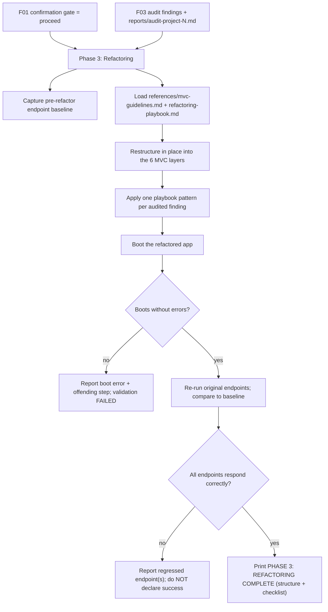

# Technical Specification: Phase 3 — MVC Refactoring & Validation (F04)

## Section 1: Technical Overview

**What:** Author the execution logic for **Phase 3 (Refactoring)** of the
`refactor-arch` skill by filling the Phase 3 section of the existing
`.claude/skills/refactor-arch/SKILL.md`. Phase 3 runs **only** when the F01
confirmation gate returned `proceed`. It consumes the F03 audit findings and the
persisted report, restructures the audited project **in place** into the six MVC
layers defined in `references/mvc-guidelines.md` (config, models, views/routes,
controllers, centralized error handling, entry point), and applies a concrete
transformation pattern from `references/refactoring-playbook.md` to eliminate
each audited anti-pattern. It then **validates** the result by booting the
application and confirming it starts without errors, and by exercising the
original endpoints with a **before/after baseline comparison** to confirm they
still respond correctly. It ends by printing a `PHASE 3: REFACTORING COMPLETE`
summary — reported successful only if both the boot check and the endpoint
checks pass.

**Why:** The refactor is the payoff of the whole pipeline, and also the only
phase that mutates source, so it must be principled and provably safe. Driving
every change from the F03 findings + the F01 playbook keeps the transformation
deterministic (each fix maps to an audited anti-pattern and a named pattern) and
technology-agnostic (the same guidelines/playbook work on Flask and Express). The
boot + endpoint validation is what lets the skill refuse to declare success on a
broken refactor, honoring the PRD's "never break the running application"
guarantee.

**Scope:**

**Included:**
- Phase 3 execution instructions written into the `SKILL.md` Phase 3 section:
  gating on `proceed`; restructuring in place into the six MVC layers via
  `mvc-guidelines.md`; applying a `refactoring-playbook.md` pattern per finding.
- Extracting configuration and credentials out of source into a config module,
  eliminating the hardcoded secrets flagged by the audit.
- Centralizing error handling and establishing a clear entry point / composition
  root with dependency injection.
- **Before/after baseline validation**: capture each original endpoint's
  response before refactoring, boot the refactored app, re-run the same requests,
  and compare — plus a boot-without-errors check.
- The `PHASE 3: REFACTORING COMPLETE` summary: new MVC tree + a validation
  checklist (app boots, endpoints respond, zero targeted anti-patterns
  remaining).
- Error handling: boot failure, endpoint regression, and unsafe-transformation
  cases; success reported only when boot **and** endpoint checks pass.

**Excluded (owned by other features):**
- The MVC layer *definitions* and the transformation *patterns* — authored by F01
  in `references/mvc-guidelines.md` and `references/refactoring-playbook.md`; F04
  only consumes them.
- The audit *findings* and their locations/severities — produced by F03; F04
  consumes them as the exact set to eliminate.
- The confirmation-gate *mechanics* (prompt, `y`/anything-else capture,
  proceed/abort decision) — owned by the F01 orchestrator; F04 only reads the
  resulting `proceed` signal.
- Detection/audit re-runs, and any behavior outside architecture/anti-pattern
  remediation (no new features, no business-logic bug fixes beyond the audited
  anti-patterns — per PRD Out of Scope).
- Committing, pushing, deploying, or generating tests (PRD Out of Scope).

## Section 2: Architecture Impact

**Affected components:**

| Path | Role | New/Modified |
|------|------|--------------|
| `.claude/skills/refactor-arch/SKILL.md` (Phase 3 section) | Phase 3 execution logic | Modified |
| `.claude/skills/refactor-arch/references/mvc-guidelines.md` | Target MVC layer definitions (read-only input) | Consumed (from F01) |
| `.claude/skills/refactor-arch/references/refactoring-playbook.md` | Transformation patterns (read-only input) | Consumed (from F01) |
| The audited target project's source tree | Restructured in place into MVC | Modified at refactor time |

## Section 3: Technical Decisions

| Decision | Chosen Approach | Alternative Considered | Trade-off |
|----------|-----------------|------------------------|-----------|
| Where Phase 3 logic lives | Instructions authored into the `SKILL.md` Phase 3 section | A separate `phase-3.md` loaded by the orchestrator | Keeps the phase sequence and its logic in one orchestrator file (matches the F01–F03 layout) at the cost of a longer `SKILL.md` |
| Refactor target | Restructure the project **in place** on the working tree | Emit a copy under `<project>-refactored/` | Matches the PRD's "restructures the project" wording and keeps one tree; relies on the user's VCS as the safety net (the gate already guarded the change) |
| Change source of truth | Every change is driven by an F03 finding + a named playbook pattern | Free-form "improve the code" refactor | Guarantees each fix is traceable to an audited anti-pattern and a transformation pattern; bounded by the audited set |
| Endpoint validation | **Before/after baseline compare**: record each original endpoint's response before refactoring, replay after, compare status/shape | Post-refactor smoke only (assert non-5xx) | Proves behavior is preserved, not merely that routes exist; costs a second boot and a baseline capture |
| Config & secrets | Extract into a config module backed by environment variables (playbook P-01); ship a `.env.example` | Leave config inline but centralized | Eliminates hardcoded secrets (an AC) and matches MVC layer 1; requires documenting the required env vars |
| Unsafe transformation | Report the finding as **unresolved** and leave that code unchanged | Apply a best-effort partial change | Avoids introducing a broken/partial change; the operator reviews the unresolved finding instead of trusting a risky edit |
| Success criterion | Report success only when boot **and** endpoint baseline checks both pass | Report success on boot alone | Honors the PRD's "never declare success unless both checks pass"; a green boot with a regressed endpoint is still a failure |

## Section 4: Component Overview

| File Path | New/Modified | Purpose | Key Responsibilities |
|-----------|--------------|---------|----------------------|
| `.claude/skills/refactor-arch/SKILL.md` (Phase 3 — Refactoring section) | Modified | Phase 3 execution logic | Gate on `proceed`; capture the pre-refactor endpoint baseline; load `mvc-guidelines.md` + `refactoring-playbook.md`; restructure in place into the six MVC layers; apply one playbook pattern per F03 finding (extract config/secrets, split God Class, move logic to controllers, DI, centralize errors, fix N+1, replace deprecated APIs, etc.); boot the app; re-run endpoints and compare to baseline; handle boot-failure / endpoint-regression / unsafe-transformation; print the `PHASE 3: REFACTORING COMPLETE` summary only when both checks pass |
| `.claude/skills/refactor-arch/references/mvc-guidelines.md` | Unmodified (consumed) | Target architecture input | Provides the six MVC layer definitions and the conformance checklist F04 restructures toward |
| `.claude/skills/refactor-arch/references/refactoring-playbook.md` | Unmodified (consumed) | Transformation patterns input | Provides the 12 before/after patterns (P-01…P-12), one per fixable catalog anti-pattern, F04 applies |
| Target project source (e.g., `<project>/config/`, `models/`, `routes/`, `controllers/`, `middleware/`, entry point) | Modified (runtime) | The refactored MVC project | The in-place restructured tree Phase 3 produces and validates |

## Section 5: Internal Interface Contracts

Phase 3 exposes no HTTP API of its own. It consumes control + knowledge signals
from F01 and the findings from F03, and provides a validation summary, per PRD
Section 6 (F04 Consumes / Provides) and Section 9 (Cross-Feature Integration).

**Contract A: Consumes — Confirmation Gate Decision (from F01)**

| Input | Provided by | Guarantee relied upon |
|-------|-------------|-----------------------|
| Gate decision = `proceed` | F01 orchestrator | Phase 3 executes only on `proceed`; on `abort` it never runs and the project stays byte-for-byte unmodified |

**Contract B: Consumes — MVC Guidelines + Refactoring Playbook (from F01)**

| Input | Provided by | Guarantee relied upon |
|-------|-------------|-----------------------|
| `references/mvc-guidelines.md` | F01 | Definitions for config, models, views/routes, controllers, centralized error handling, entry point |
| `references/refactoring-playbook.md` | F01 | ≥8 (12) before/after patterns; every fixable catalog anti-pattern maps to ≥1 pattern |

**Contract C: Consumes — Audit Findings + Persisted Report (from F03)**

| Input | Provided by | Guarantee relied upon |
|-------|-------------|-----------------------|
| Audit findings (anti-pattern, severity, `file:line`, recommendation) | F03 | The exact set of issues Phase 3 must eliminate |
| `reports/audit-project-N.md` | F03 | Reflects the same findings F04 acts upon |

**Contract D: Provides — Refactor & Validation Summary (terminal)**

| Field | Part of | Guaranteed to contain |
|-------|---------|-----------------------|
| New MVC structure | Summary | The restructured directory tree (config, models, routes/views, controllers, middleware, entry point) |
| Boot check | Validation checklist | Whether the refactored app boots without errors |
| Endpoint check | Validation checklist | Whether each original endpoint responds correctly vs the pre-refactor baseline |
| Anti-patterns remaining | Validation checklist | Confirmation that zero targeted anti-patterns remain (or the list of unresolved findings) |

Contract guarantee: Phase 3 modifies source only after `proceed`; each change
traces to an F03 finding and a playbook pattern; and success is reported only
when the boot **and** endpoint checks both pass.

## Section 6: Refactoring Output Schema

Phase 3 emits a printed summary. This section defines the required structure of
that block.

**`PHASE 3: REFACTORING COMPLETE` — required content**

| Block | Required | Content |
|-------|----------|---------|
| Title | Yes | Exactly `PHASE 3: REFACTORING COMPLETE` |
| New structure | Yes | The new MVC directory tree (the six layers, adapted to the stack) |
| Transformations applied | Yes | Each audited finding paired with the playbook pattern used to fix it (e.g., `AP-01 → P-01`), or marked **unresolved** if it could not be safely applied |
| Validation checklist | Yes | `Application boots without errors` ✓/✗; `All endpoints respond correctly` ✓/✗ (vs baseline); `Zero targeted anti-patterns remaining` ✓/✗ |
| Outcome | Yes | Success only if boot ✓ **and** endpoints ✓; otherwise a failure/partial result naming the boot error or the regressed endpoint(s) |

**Constraints:**
- The refactored project follows the six-layer MVC structure from
  `mvc-guidelines.md`; no hardcoded secrets remain in source.
- Every audited anti-pattern is addressed via a playbook pattern, or explicitly
  reported unresolved.
- The block is printed only after validation runs; success is never claimed when
  the boot check or any endpoint check fails.
- Original endpoint behavior is preserved (responses match the pre-refactor
  baseline within expected shape/status).

**Reference outcomes for the three validation targets** (illustrative):

| Project | Representative transformations | Endpoints validated |
|---------|-------------------------------|---------------------|
| `code-smells-project` | P-03 split God File, P-04 logic→controllers, P-01 config, P-06 N+1, P-10 magic numbers | `/produtos`, `/usuarios`, `/pedidos` families |
| `task-manager-api` | P-04 logic→controllers, P-07 dedup, P-05 DI, P-11 replace `datetime.utcnow()`, P-10 constants | task / user / report routes |
| `ecommerce-api-legacy` | P-01 extract secrets, P-08 auth middleware, P-03 split `AppManager`, P-06 N+1 report, P-05 DI | `POST /api/checkout`, `GET /api/admin/financial-report`, `DELETE /api/users/:id` |

## Section 7: Testing Strategy

Because the deliverable is prompt-driven Markdown, verification combines
automatable structural lint checks with behavioral runs against the three target
projects. No unit-test framework is introduced.

**Structural checks (automatable):**

| Check | Target | Assertion |
|-------|--------|-----------|
| Phase 3 section authored | `SKILL.md` Phase 3 section | Contains refactoring instructions (not just the F01 stub) and references `mvc-guidelines.md` and `refactoring-playbook.md` |
| Gate-guarded | `SKILL.md` Phase 3 section | States Phase 3 runs only on `proceed`; on `abort` the project is unmodified |
| Six MVC layers specified | `SKILL.md` Phase 3 section | Instructs restructuring into config, models, views/routes, controllers, centralized error handling, entry point |
| Finding→pattern mapping | `SKILL.md` Phase 3 section | Instructs applying a playbook pattern per audited finding; unsafe cases reported unresolved |
| Validation specified | `SKILL.md` Phase 3 section | Instructs the boot check and the before/after endpoint baseline comparison |
| Success gate | `SKILL.md` Phase 3 section | States success is reported only when boot and endpoint checks both pass |
| No hardcoded stack | `SKILL.md` Phase 3 section | Transformations come from the playbook/guidelines; no per-project refactor baked in |

**Acceptance tests (behavioral, from PRD Section 9 F04 criteria):**

| Test | Description | Assertions |
|------|-------------|------------|
| `test_runs_only_on_confirm` | Decline the gate, then accept it | On decline the project is unmodified; on `proceed` Phase 3 executes |
| `test_mvc_structure` | Inspect the refactored tree | Follows MVC layout (config, models, views/routes, controllers, centralized error handling, entry point) |
| `test_no_hardcoded_secrets` | Grep the refactored source | Config/credentials extracted into a config module; no hardcoded secrets remain |
| `test_each_antipattern_addressed` | Map findings to changes | Each audited anti-pattern is addressed via a playbook pattern (or reported unresolved) |
| `test_app_boots` | Boot the refactored app | Starts without errors |
| `test_endpoints_respond` | Re-run original endpoints vs baseline | Each original endpoint responds correctly after the refactor |
| `test_validation_summary` | Inspect the summary block | Lists the new structure and the passed checks (boots, endpoints respond, zero anti-patterns remaining) |
| `test_success_requires_both_checks` | Force a boot or endpoint failure | Phase 3 is not reported successful unless both the boot and endpoint checks pass |
| `test_boot_failure_reported` | Introduce a boot error | Reports the boot error and offending step; flags validation failed rather than success |
| `test_endpoint_regression_reported` | Break one endpoint | Reports which endpoint regressed |
| `test_unsafe_transformation_unresolved` | A finding that can't be safely transformed | Reported as unresolved rather than applying a partial/broken change |

**Integration tests (from PRD Section 9 Cross-Feature Integration referencing F04):**

| Test | Description | Assertions |
|------|-------------|------------|
| `test_knowledge_feeds_f04` | Run Phase 3 across the targets | The MVC guidelines + refactoring playbook loaded by F01 are the exact knowledge F04 uses; no hardcoded stack assumptions |
| `test_findings_are_the_fix_set` | Compare F03 findings to F04 changes | The audit findings (anti-pattern, severity, `file:line`, recommendation) are the exact set F04 eliminates |
| `test_gate_controls_f04` | Toggle the gate decision | `proceed` → refactor executes; `abort` → project stays unmodified |
| `test_report_matches_fix_set` | Compare the persisted report to F04's actions | `reports/audit-project-N.md` reflects the same findings F04 acts upon |

## Section 8: Assumptions & Decisions

Applied where the PRD left a detail open; recorded here for review.

- **Refactor is in place.** Phase 3 restructures the project in its own directory
  on the working tree rather than emitting a copy; the user's VCS is the rollback
  path, and the confirmation gate already guarded the mutation. (Interview
  decision.)
- **Endpoint validation is a before/after baseline compare.** Phase 3 records each
  original endpoint's response before refactoring, boots the refactored app, and
  replays the same requests to compare status/shape — stronger evidence than a
  post-refactor non-5xx smoke test. (Interview decision.)
- **Every change is finding-driven.** Phase 3 only applies transformations that
  correspond to an F03 finding and a named playbook pattern; it does not perform
  unrelated rewrites or fix business-logic bugs outside the audited set. (Derived
  from PRD F04 Capabilities + Out of Scope.)
- **Unsafe transformations are left unresolved.** If a finding cannot be safely
  transformed, Phase 3 leaves that code unchanged and reports the finding as
  unresolved instead of applying a partial change. (Derived from PRD F04 Error
  Handling.)
- **Config extraction ships a `.env.example`.** Secrets move to a config module
  backed by environment variables (playbook P-01), with required vars documented;
  `.env` itself is not committed. (Derived from PRD F04 Capabilities + playbook
  P-01.)
- **Success is boot AND endpoints.** Phase 3 never prints a successful
  `PHASE 3: REFACTORING COMPLETE` unless the app boots without errors and every
  original endpoint matches its baseline. (Derived from PRD F04 Error Handling +
  acceptance criteria.)
- **The gate mechanics are not re-specified in F04.** F04 reads the `proceed`
  signal produced by the F01 orchestrator's gate; it does not implement its own
  prompt. (Derived from F01 spec Contract B.)
