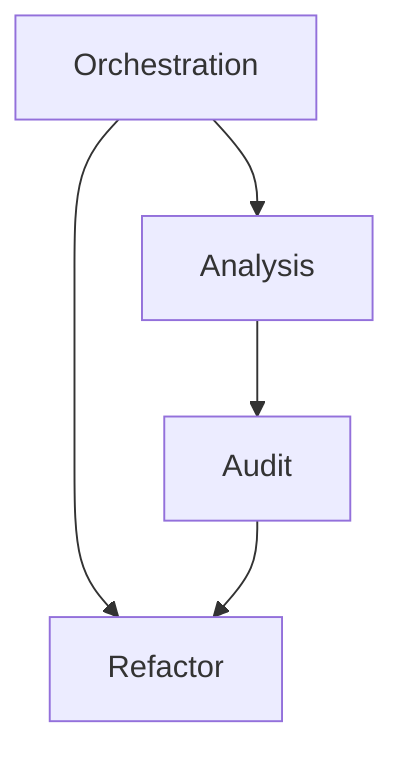

# refactor-arch — Architecture Audit & Refactoring Skill

## 1. Executive Summary

`refactor-arch` is a Custom Skill for Claude Code that turns the agent into an on-demand software architecture specialist. Invoked with a single command (`claude "/refactor-arch"`) inside any project directory, it runs a three-phase pipeline — **Analysis**, **Audit**, and **Refactoring** — that detects the project's stack, cross-references the code against a catalog of anti-patterns, produces a severity-ranked audit report, and (after explicit human approval) restructures the codebase into the MVC (Model-View-Controller) pattern while proving the application still boots and its endpoints still respond.

The skill is built for engineers who inherit legacy codebases and cannot afford to spend days manually auditing and rewriting them. Its core value is repeatable, standardized, low-risk architectural remediation: every run yields the same structured report format, classifies each finding by severity with exact file and line references, and never mutates a single file before a human reviews and confirms the plan.

Critically, `refactor-arch` is **technology-agnostic**. The same skill folder, copied unchanged, must work across Python/Flask and Node.js/Express projects — detection heuristics, the anti-pattern catalog, and the refactoring playbook are expressed as reusable Markdown reference knowledge rather than stack-specific scripts. It is validated against three provided legacy projects and must meet the same acceptance bar on all of them.

## 2. Problem and Opportunity

### The Problem

**Manual architectural audits are slow and do not scale**
- Reviewing a single legacy service by hand takes hours to days of senior engineer time
- Inheriting multiple projects at once (3+) multiplies the cost linearly
- The work is repetitive and pattern-based — exactly the kind of task that should be automated

**Findings are inconsistent and not actionable**
- Ad-hoc reviews produce prose notes without severity, without exact `file:line` locations, and without a standard format
- Two reviewers audit the same code and report different things
- Teams cannot triage or prioritize because "bad code" is not quantified

**Automated refactors are risky and break applications**
- Bulk find-and-replace or one-off scripts silently break routing, imports, or business behavior
- There is no validation step confirming the app still boots and endpoints still respond
- Engineers avoid automating refactors precisely because the blast radius is unbounded

**Remediation tools are coupled to a single stack**
- A script written for Flask does not work on Express; knowledge is re-implemented per language
- One-off tooling is thrown away after a single project instead of being reused

**Uncontrolled automation removes the human checkpoint**
- Fully automated "fix everything" agents modify files before anyone reviews the plan
- There is no gate where a lead can reject or scope down the proposed changes

### The Opportunity

`refactor-arch` addresses each pain directly. It replaces days of manual review with a single command that finishes an audit in minutes (slow audits → automated pipeline). It emits a standardized, severity-ranked report where every finding carries an exact `file:line` and a concrete recommendation (inconsistent findings → structured report). It validates the refactored app by booting it and exercising its endpoints, refusing to declare success otherwise (risky refactors → validated output). It encodes all knowledge as stack-agnostic Markdown reference files so the same skill runs on Flask and Express alike (single-stack coupling → reusable skill). And it enforces a mandatory confirmation gate: no file is touched until a human reviews the audit report and approves (uncontrolled automation → human-in-the-loop).

## 3. Target Audience

### Primary Users

**Maintenance Engineer (skill operator)**
- Inherits one or more legacy services and is tasked with cleaning up architecture, security, and code quality
- Works across languages (Python, Node.js) and does not want to learn a different tool per stack
- Needs the audit and refactor done quickly and safely, without breaking the running application

**Tech Lead / Reviewer (approval authority)**
- Reviews the Phase 2 audit report before any code changes and decides whether to proceed
- Cares about severity distribution, false positives, and the blast radius of the proposed refactor
- Is accountable for the codebase staying functional after changes are merged

### Behavioral Profile

- Comfortable running CLI tools and reading Markdown reports
- Distrusts opaque automation — expects to see exactly what will change before it changes
- Values exact locations (`file:line`), reproducible output, and an explicit success/failure signal over vague summaries

## 4. Objectives

**Detect** the project stack correctly across technologies
- Language and framework identified correctly in 3/3 target projects (Python/Flask ×2, Node.js/Express ×1)
- Application domain and analyzed file count match reality in 3/3 projects

**Surface** high-impact architectural findings
- At least 5 findings reported per project, each with exact `file:line`
- At least 1 CRITICAL or HIGH finding surfaced per project
- Anti-pattern catalog covers at least 8 distinct anti-patterns spanning all four severities, including deprecated-API detection

**Enforce** a mandatory human review gate
- 100% of runs pause after Phase 2 and require explicit confirmation before any file is modified
- Zero files mutated in any run where the user declines

**Deliver** a working MVC refactor
- Application boots without errors after Phase 3 in 3/3 projects
- Original endpoints respond correctly after refactor in 3/3 projects
- Refactoring playbook provides at least 8 before/after transformation patterns

**Reuse** the skill unchanged across stacks
- The same `.claude/skills/refactor-arch/` folder, copied without edits, passes all acceptance criteria on both a Flask and an Express project

## 5. User Stories

### F01. Skill Orchestration & Invocation
- As a maintenance engineer, I want to run `/refactor-arch` in any project directory so that the full audit-and-refactor pipeline starts without extra configuration
- As a maintenance engineer, I want the skill to run its three phases in strict order so that no refactor happens before analysis and audit complete
- As a tech lead, I want the skill to halt and wait for my explicit approval between audit and refactor so that no code changes without review
- As the system, I want to load detection heuristics, the anti-pattern catalog, and the refactoring playbook from Markdown reference files so that the same skill works across different stacks
- As a maintenance engineer, I want to copy the skill folder unchanged into another project so that I can reuse it without rewriting anything

### F02. Phase 1 — Project Analysis
- As a maintenance engineer, I want the skill to detect the language and framework automatically so that I don't have to describe my stack
- As a maintenance engineer, I want the skill to identify the database tables and dependencies so that I understand the data layer at a glance
- As a maintenance engineer, I want the skill to describe the current architecture and the application domain so that I get context before the audit
- As a maintenance engineer, I want a printed summary of files analyzed and stack detected so that I can confirm the skill is looking at the right project

### F03. Phase 2 — Architecture Audit & Report
- As a tech lead, I want each finding classified by severity (CRITICAL/HIGH/MEDIUM/LOW) so that I can prioritize remediation
- As a maintenance engineer, I want every finding to include the exact file and line range so that I can jump straight to the problem
- As a tech lead, I want findings ordered from CRITICAL to LOW so that the most urgent issues appear first
- As a maintenance engineer, I want a summary count per severity so that I understand the overall health at a glance
- As a maintenance engineer, I want the report saved to a file so that I can share it and keep it as a record
- As a tech lead, I want the skill to ask for confirmation before proceeding to refactoring so that I stay in control of any code changes

### F04. Phase 3 — MVC Refactoring & Validation
- As a maintenance engineer, I want the project restructured into models, views/routes, and controllers so that responsibilities are separated
- As a maintenance engineer, I want configuration and secrets extracted out of the code into a config module so that nothing sensitive stays hardcoded
- As a maintenance engineer, I want error handling centralized so that failures are handled consistently
- As a maintenance engineer, I want each audited anti-pattern eliminated using a concrete transformation pattern so that the refactor is principled, not ad-hoc
- As a maintenance engineer, I want the skill to boot the refactored app and exercise its endpoints so that I know it still works before I commit
- As a tech lead, I want a final validation summary listing what changed and what passed so that I can trust the result

## 6. Functionalities

### F01. Skill Orchestration & Invocation

**Provides:**
- Loaded reference knowledge — stack-detection heuristics, anti-pattern catalog, MVC architecture guidelines, refactoring playbook (used by F02, F03, F04)
- Confirmation gate decision — proceed / abort signal captured between Phase 2 and Phase 3 (used by F04)

**Capabilities:**
- Single entry point: `SKILL.md` invoked via `claude "/refactor-arch"`, runnable from the target project root with zero additional flags
- Enforces strict sequential execution of exactly three phases: Analysis → Audit → Refactoring; a later phase never starts before the earlier one finishes
- Loads domain knowledge exclusively from Markdown reference files bundled in `.claude/skills/refactor-arch/`: at least one file each for detection heuristics, an anti-pattern catalog (≥8 anti-patterns across all four severities, including deprecated-API detection), an audit report template, MVC architecture guidelines, and a refactoring playbook (≥8 before/after transformation patterns)
- Fully self-contained and copyable: the entire skill folder must run correctly after being copied unchanged into a different project (no project-specific paths, names, or stack assumptions baked in)
- Mandatory human gate: after Phase 2 the skill pauses and does not modify any file until the user explicitly confirms (`y`); a decline aborts before Phase 3 with zero mutations

**Experience:**
The user runs `claude "/refactor-arch"` from the project directory. The skill announces Phase 1, prints the analysis summary, transitions to Phase 2, prints the audit report, then displays a blocking prompt such as `Phase 2 complete. Proceed with refactoring (Phase 3)? [y/n]`. On `y`, Phase 3 runs and reports completion. On `n`, the skill exits cleanly, having changed nothing. The same sequence must reproduce identically when the folder is copied into another project.

**Error Handling:**
- If the target directory has no recognizable source files, Phase 1 reports `No analyzable source files found` and the skill stops before Phase 2
- If reference knowledge files are missing from the skill folder, the skill reports which file is missing and refuses to continue rather than silently skipping a phase
- If the confirmation prompt receives anything other than `y`, the skill treats it as a decline and exits without modifying files
- If the skill is interrupted between phases, it must not leave the project in a partially modified state — no file is written before the Phase 3 confirmation is granted

### F02. Phase 1 — Project Analysis

**Consumes:**
- F01: stack-detection heuristics reference

**Provides:**
- Stack profile — detected language, framework and version, dependencies, application domain (used by F03)
- Architecture map — current structure description, list of source files analyzed, database tables detected (used by F03)

**Capabilities:**
- Detects language, framework (with version when available), and dependency list using signal-based heuristics (e.g., `requirements.txt` + `from flask import` → Python/Flask; `package.json` + `require('express')` → Node.js/Express)
- Detects database tables/entities by scanning schema, migrations, or SQL/ORM definitions
- Infers the application domain from routes, model names, and table names (e.g., "E-commerce API — produtos, pedidos, usuários")
- Describes the current architecture at a high level (e.g., "Monolithic — everything in 4 files, no layer separation")
- Reports an accurate count of source files analyzed that matches the real number of files in the project

**Experience:**
Phase 1 prints a fixed-format summary block titled `PHASE 1: PROJECT ANALYSIS` containing Language, Framework, Dependencies, Domain, Architecture, Source files count, and DB tables. The values reflect the actual project so the user can immediately confirm the skill is analyzing the correct codebase before the audit begins. No files are modified during this phase.

### F03. Phase 2 — Architecture Audit & Report

**Consumes:**
- F02: stack profile (language, framework, dependencies, domain), architecture map (source files analyzed, database tables)

**Provides:**
- Audit findings — ordered list of findings, each with anti-pattern name, severity, exact `file:line`, description, impact, and recommendation (used by F04)
- Persisted audit report file — the full report saved to `reports/audit-project-N.md` (used by F04)

**Capabilities:**
- Cross-references the analyzed code against the anti-pattern catalog and produces at least 5 findings per project, with at least 1 CRITICAL or HIGH
- Classifies every finding into exactly one of four severities — CRITICAL, HIGH, MEDIUM, LOW — per the standardized severity scale (security/architecture failures → CRITICAL; MVC/SOLID violations → HIGH; standardization/duplication/moderate performance → MEDIUM; readability/naming/magic numbers → LOW)
- Includes deprecated-API detection among the catalog checks when applicable to the detected stack
- Every finding carries an exact location as `file:line` or `file:start-end`, plus a description, an impact statement, and a concrete recommendation
- Findings are ordered by severity, CRITICAL first through LOW last
- Emits a per-severity summary count (e.g., `CRITICAL: 4 | HIGH: 5 | MEDIUM: 2 | LOW: 3`) and a total finding count
- Renders the report using the standardized report template defined in the skill's reference files and saves it to `reports/audit-project-N.md`
- Ends the phase by requesting explicit human confirmation before any refactoring occurs

**Experience:**
Phase 2 prints an `ARCHITECTURE AUDIT REPORT` block: project name, stack, file/line counts, a severity summary line, then each finding as `[SEVERITY] Anti-pattern name` with File, Description, Impact, and Recommendation. Findings appear CRITICAL → LOW. The report is written to `reports/audit-project-N.md`. The phase closes with a blocking confirmation prompt; no source file is modified at this point.

**Error Handling:**
- If fewer than 5 findings are detected, the report still renders but flags that the minimum finding threshold was not met, so the operator can widen the catalog or re-run
- If the `reports/` directory does not exist, the skill creates it before writing rather than failing
- If report generation fails to write the file, the skill surfaces the write error and does not advance to the confirmation prompt (the user must have the report to review)
- The confirmation prompt must appear only after the report is fully rendered and saved, never before

### F04. Phase 3 — MVC Refactoring & Validation

**Consumes:**
- F01: refactoring playbook and MVC architecture guidelines, confirmation gate decision (proceed)
- F03: audit findings (anti-pattern, severity, `file:line`, recommendation), persisted audit report

**Capabilities:**
- Runs only after the F01 confirmation gate returns proceed; if the gate returned abort, this phase never executes
- Restructures the project into an MVC directory layout: a config module (no hardcoded secrets), models (data abstraction), views/routes (routing), controllers (application flow), centralized error handling/middleware, and a clear entry point / composition root
- Extracts configuration and credentials out of source into a config module, eliminating hardcoded secrets flagged in the audit
- Applies a concrete transformation pattern from the refactoring playbook to eliminate each audited anti-pattern (God Class split, business logic moved out of controllers, dependency injection, N+1 query fixes, deprecated-API replacement, magic-number extraction, etc.)
- Validates the result by booting the application and confirming it starts without errors, then exercising the original endpoints to confirm they still respond correctly
- Reports a final validation summary: the new project structure, a checklist of validation checks (app boots, endpoints respond, anti-patterns remaining), and confirmation that zero targeted anti-patterns remain

**Experience:**
After the user confirms, Phase 3 executes the refactor and prints a `PHASE 3: REFACTORING COMPLETE` block showing the new MVC directory tree and a Validation section with checkmarks: application boots without errors, all endpoints respond correctly, zero anti-patterns remaining. The original endpoints behave the same as before the refactor, so behavior is preserved while structure is improved.

**Error Handling:**
- If the refactored application fails to boot, the skill reports the boot error and the offending step, and flags that validation failed rather than declaring success
- If any original endpoint stops responding after the refactor, the skill reports which endpoint regressed so the operator can review before committing
- If a transformation cannot be safely applied to a given finding, the skill reports that finding as unresolved instead of applying a partial/broken change
- The skill never reports Phase 3 as successful unless both the boot check and the endpoint checks pass

## 7. Out of Scope

**Target architectures**
- Architectures other than MVC (hexagonal, clean/DDD layering, event-driven, microservice decomposition) are not produced

**Testing and CI**
- The skill does not generate automated test suites or unit/integration tests
- It does not create or modify CI/CD pipelines, GitHub Actions, or deployment configuration

**Version control and deployment**
- The skill does not commit, push, or open pull requests — committing the refactored code is left to the user
- It does not deploy, containerize, or provision infrastructure

**Scope of fixes**
- It does not fix functional business-logic bugs unrelated to architecture or the audited anti-patterns
- It does not perform runtime performance profiling, load testing, or security penetration testing beyond static anti-pattern detection

**Stack coverage**
- While designed to be technology-agnostic, correctness is only validated against Python/Flask and Node.js/Express; other stacks are not guaranteed in this version

## 8. Dependency Graph

| # | Feature | Priority | Dependencies |
|---|---------|----------|--------------|
| F01 | Skill Orchestration & Invocation | 1 | None |
| F02 | Phase 1 — Project Analysis | 1 | F01 |
| F03 | Phase 2 — Architecture Audit & Report | 1 | F02 |
| F04 | Phase 3 — MVC Refactoring & Validation | 1 | F01, F03 |

### Foundation Features
These features set up shared project infrastructure. In a greenfield project they must be implemented sequentially before or alongside any feature that depends on them:
- **F01 Skill Orchestration & Invocation** — establishes the skill folder structure, the `SKILL.md` entry point, phase sequencing, the confirmation gate, and the Markdown reference-knowledge files that every later phase loads

### Execution Waves
Features within the same wave can be built in parallel. A wave starts only after every feature in earlier waves is complete.

**Note:** Foundation features (see "Foundation Features" above) cannot run in parallel in a greenfield project even if they appear together in a wave — they share scaffolding files and must be implemented sequentially until the base is in place.

- **Wave 1**: F01
- **Wave 2**: F02
- **Wave 3**: F03
- **Wave 4**: F04

### Priority levels
- **1** = Essential — product does not work without it
- **2** = Important — significant value addition
- **3** = Desirable — incremental improvement

## 9. Acceptance Criteria

### F01. Skill Orchestration & Invocation
- [ ] Running `claude "/refactor-arch"` from a target project root starts the pipeline with no additional flags
- [ ] The three phases always execute in order Analysis → Audit → Refactoring; Phase 3 never starts before Phase 2 finishes
- [ ] The skill loads detection heuristics, anti-pattern catalog, report template, MVC guidelines, and refactoring playbook from Markdown reference files
- [ ] The anti-pattern catalog contains at least 8 anti-patterns spanning all four severities and includes deprecated-API detection
- [ ] The refactoring playbook contains at least 8 before/after transformation patterns
- [ ] Copying the skill folder unchanged into a different project runs the full pipeline correctly
- [ ] After Phase 2 the skill pauses; answering anything other than `y` exits with zero files modified

### F02. Phase 1 — Project Analysis
- [ ] Language is detected correctly in each target project
- [ ] Framework (with version when available) is detected correctly in each target project
- [ ] Database tables/entities present in the project are listed
- [ ] The application domain is described accurately
- [ ] The reported count of analyzed source files matches the real number of files
- [ ] No source file is modified during Phase 1

### F03. Phase 2 — Architecture Audit & Report
- [ ] At least 5 findings are reported for each target project
- [ ] At least 1 finding is CRITICAL or HIGH in each target project
- [ ] Every finding includes an exact `file:line` (or `file:start-end`) location
- [ ] Every finding includes description, impact, and recommendation
- [ ] Findings are ordered from CRITICAL to LOW
- [ ] A per-severity summary count and a total count are shown
- [ ] The report follows the standardized template and is saved to `reports/audit-project-N.md`
- [ ] Deprecated-API findings are included when applicable to the detected stack
- [ ] The skill requests explicit confirmation before proceeding, and no file is modified before confirmation

### F04. Phase 3 — MVC Refactoring & Validation
- [ ] Phase 3 executes only after the user confirms; declining leaves the project unmodified
- [ ] The refactored project follows an MVC directory structure (config, models, views/routes, controllers, centralized error handling, clear entry point)
- [ ] Configuration and credentials are extracted into a config module with no hardcoded secrets remaining
- [ ] Each audited anti-pattern is addressed via a transformation pattern from the playbook
- [ ] The refactored application boots without errors
- [ ] The original endpoints respond correctly after the refactor
- [ ] A final validation summary lists the new structure and the passed checks (boots, endpoints respond, zero anti-patterns remaining)
- [ ] Phase 3 is not reported successful unless both the boot check and endpoint checks pass

### Cross-Feature Integration
- [ ] The stack-detection heuristics, anti-pattern catalog, MVC guidelines, and refactoring playbook loaded by F01 are the exact knowledge used by F02, F03, and F04 (no phase relies on hardcoded stack assumptions)
- [ ] The stack profile and architecture map produced by F02 (language, framework, dependencies, domain, analyzed files, DB tables) are the inputs the F03 audit reasons over
- [ ] The audit findings from F03 (anti-pattern, severity, `file:line`, recommendation) are the exact set of issues F04 eliminates during refactoring
- [ ] The confirmation gate decision captured by F01 correctly controls whether F04 runs: proceed → refactor executes, abort → project stays unmodified
- [ ] The audit report persisted by F03 to `reports/audit-project-N.md` reflects the same findings F04 acts upon
